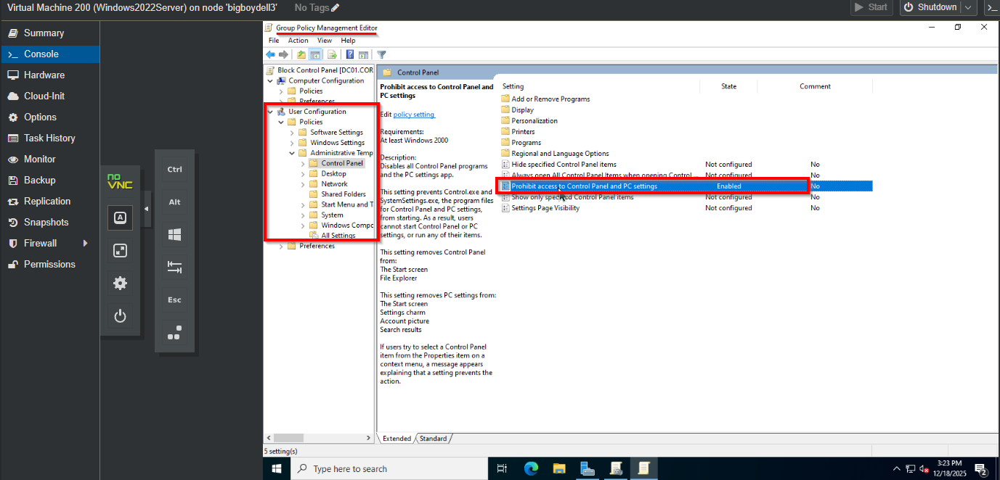
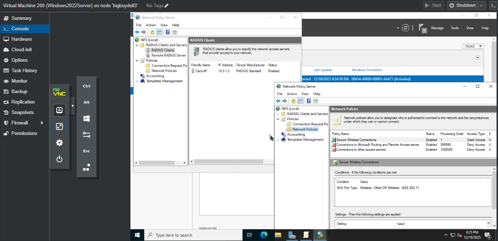
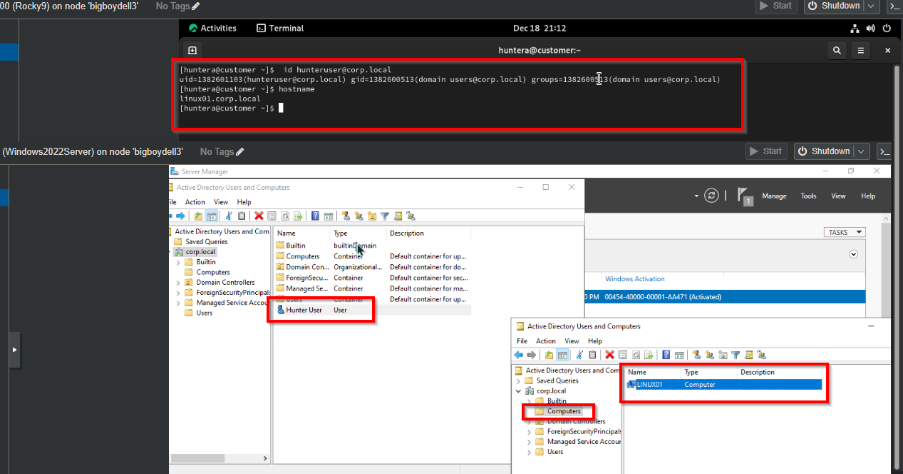

# Enterprise Identity Lab: Hybrid AD, RADIUS (AAA), & Linux

## 🎯 Objective
To design a centralized identity management system simulating a secure enterprise network. The project integrates **Active Directory** for user management, **Group Policy** for endpoint hardening, **Windows NPS (RADIUS)** for securing Wi-Fi infrastructure, and **SSSD** for authenticating Linux servers against the domain.

## 🛠 Skills Applied
- **Identity Management:** Deployed Windows Server 2022 Active Directory Domain Services (AD DS).
- **Network Security (AAA):** Configured **RADIUS/802.1X** using Windows Network Policy Server (NPS) to secure Cisco wireless infrastructure.
- **Security Baselines:** Implemented **Group Policy Objects (GPO)** to restrict user access to critical system settings (Control Panel).
- **Hybrid Integration:** Bridged Red Hat Enterprise Linux (RHEL 9) systems to Windows AD using `realmd` and `sssd`.

## 💻 Technologies
- **Server:** Windows Server 2022 (DC + NPS Roles)
- **Client:** Rocky Linux 9 (RHEL)
- **Networking:** Cisco AIR-AP2802 (RADIUS Client)
- **Protocol:** RADIUS (PEAP/MS-CHAPv2)

## 📝 Steps Performed

### 1. Domain Controller & GPO Enforcement
- Promoted Windows Server 2022 to Domain Controller (`corp.local`).
- Created and **Linked** a Group Policy Object to the domain root to enforce security standards.
- **Policy Configured:** "Prohibit access to Control Panel" (Enabled).

### 2. RADIUS Server Configuration (NPS)
- Installed the **Network Policy and Access Services** role.
- Configured the Cisco Wireless Access Point as a **RADIUS Client** using a shared secret.
- Defined Network Policies to allow **PEAP-MSCHAPv2** authentication for the "Domain Users" group.
- *Outcome:* Users can now log into the Enterprise Wi-Fi using their Active Directory credentials.

### 3. Linux Domain Integration
- Configured RHEL 9 DNS to resolve to the Domain Controller.
- Used `realmd` to join the Linux host to the Windows Domain.
- Verified centralized authentication by querying AD user attributes from the Linux terminal.

## 📂 Architecture Note
This lab runs on a **Proxmox VE** hypervisor, demonstrating the ability to manage virtualized mixed-OS environments.

## 📚 References & Resources
- **NPS Setup:** [Configure NPS for 802.1X Wireless](https://learn.microsoft.com/en-us/windows-server/networking/technologies/nps/nps-radius-server-8021x-wireless)
- **Linux Integration:** [Red Hat Enterprise Linux - Integration with Active Directory](https://www.youtube.com/watch?v=CGt6oHZPToY)
